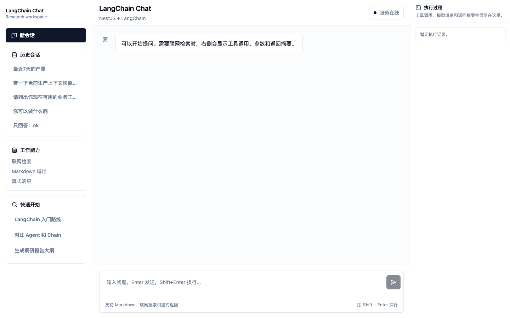

# Chat Agent

Chat Agent 是一个面向企业业务数据问答和联网研究的全栈智能体项目。它把 NestJS、LangChain、DeepAgent、MCP 工具、PostgreSQL 历史会话和 React 聊天界面整合在一起，目标是提供一个可扩展、可观察、可持续演进的 Agent 应用底座。



## 项目目标

- 构建一个真正可用的聊天式 Agent，而不是单页 Demo。
- 让模型可以调用互联网搜索和 MCP 业务工具，回答具备数据来源的问题。
- 通过 SSE 流式返回，让用户看到模型生成、工具调用、工具返回等中间过程。
- 用 PostgreSQL 保存历史会话，支持查看历史、切换会话和继续上下文对话。
- 保持前后端分层清晰，方便继续扩展工具、鉴权、知识库、审计和多租户能力。

## 当前能力

- 流式聊天：基于 SSE 返回模型 token 和执行事件。
- Markdown 渲染：支持标题、列表、表格、代码块等常用格式。
- 历史会话：左侧显示历史会话标题，点击后恢复完整上下文。
- 续聊能力：切换历史会话后继续沿用原 `sessionId` 对话。
- MCP 工具接入：通过可配置 `MCP_URL` 和 `MCP_API_KEY` 动态读取 MCP `tools/list`，并注册到 LangChain Agent。
- 业务工具可观察：右侧执行过程展示模型请求、工具调用参数和工具返回摘要。
- 联网搜索：内置 Tavily 互联网搜索工具。
- 数据库存储：使用 TypeORM + PostgreSQL 保存聊天消息。
- 日志落盘：NestJS 日志写入 `logs/app.log`。
- 前端工程化：React 组件拆分，Tailwind CSS v4 + shadcn 风格本地组件。
- Vite with Bun：前端 dev/build 通过 `bunx --bun vite` 执行。

## 技术栈

后端：
- NestJS 11
- LangChain / DeepAgent
- OpenAI-compatible Chat Model
- MCP JSON-RPC over HTTP/SSE
- TypeORM
- PostgreSQL / pgvector 镜像
- Express SSE

前端：
- React 19
- Vite 8
- Tailwind CSS v4
- shadcn-style local components
- Radix ScrollArea
- react-markdown + remark-gfm
- lucide-react

工程：
- TypeScript strict mode
- Yarn scripts
- Bun-powered Vite
- Docker PostgreSQL

## 架构说明

```text
client/
  React Chat UI
  - 历史会话侧栏
  - Markdown 消息渲染
  - SSE 消费
  - 工具执行过程面板

src/
  main.ts
    Nest bootstrap、静态资源托管、日志初始化

  chat/
    ChatController
      POST /api/chat
      POST /api/chat/stream
      GET  /api/chat/sessions
      GET  /api/chat/history

    ChatHistoryService
      TypeORM 持久化消息
      查询历史会话和完整上下文

  langchain/
    LangChainService
      创建 DeepAgent
      注册 internet_search 和 MCP tools
      转发 SSE token / activity events

  mcp/
    McpClientService
      tools/list
      tools/call
      JSON Schema -> zod schema
      MCP SSE / JSON 响应解析

  logger/
    FileLogger
      Nest 日志落盘
```

请求链路：

```text
React Composer
  -> POST /api/chat/stream
  -> ChatController
  -> LangChainService
  -> DeepAgent
  -> internet_search / MCP tools
  -> SSE: activity + delta + done
  -> PostgreSQL 保存 user / assistant 消息
```

## MCP 工具

项目支持通过环境变量接入 MCP 服务：

```env
MCP_URL=http://your-host:5100/mcp
MCP_API_KEY=replace-me
MCP_TIMEOUT_MS=60000
```

后端会在 Agent 初始化时：

- 请求 `tools/list` 获取远端工具列表。
- 将每个工具的 `inputSchema` 转成 zod schema。
- 使用 LangChain `tool()` 动态注册工具。
- 工具调用时通过 `tools/call` 转发参数。
- 将 MCP 工具清单注入 system prompt，让业务问题优先走 MCP。

适合接入的业务工具包括生产上下文、质量分析、OEE、SPC、产量、工艺路线、报警、数据库查询、追溯等。

## 环境配置

复制配置模板：

```bash
cp .env.example .env
```

主要配置：

```env
PORT=3000
TZ=Asia/Shanghai
CHAT_TIMEOUT_MS=60000

MODEL_NAME=mimo-v2.5-pro
OPENAI_BASE_URL=https://your-openai-compatible-endpoint/v1
OPENAI_API_KEY=replace-me
TAVILY_API_KEY=replace-me

MCP_URL=http://your-host:5100/mcp
MCP_API_KEY=replace-me
MCP_TIMEOUT_MS=60000

PG_HOST=127.0.0.1
PG_PORT=5432
PG_USER=postgres
PG_PASSWORD=mypassword
PG_DATABASE=ai_knowledge_base
```

`.env` 已被 `.gitignore` 忽略，不应提交真实密钥。

## 本地运行

启动已有 PostgreSQL 容器：

```bash
yarn pg:up
```

安装依赖：

```bash
yarn install
```

开发模式：

```bash
yarn dev
```

前端 Vite 默认运行在 `5173`，后端 Nest 默认运行在 `3000`。

生产构建：

```bash
yarn build
yarn start
```

只构建前端：

```bash
yarn build:client
```

只构建后端：

```bash
yarn build:server
```

## API

```text
POST /api/chat
```

普通非流式对话。

```text
POST /api/chat/stream
```

SSE 流式对话，返回事件：

- `start`
- `activity`
- `delta`
- `done`
- `error`

```text
GET /api/chat/sessions
```

返回历史会话列表。

```text
GET /api/chat/history?sessionId=...
```

返回指定会话的完整消息。

## 前端界面

当前界面分为三栏：

- 左侧：新会话、历史会话、工作能力、快捷问题。
- 中间：聊天消息流，支持 Markdown 和流式输出。
- 右侧：执行过程，展示模型请求、读取 MCP、工具调用参数和工具返回摘要。

设计风格使用 shadcn 默认中性色，不使用强烈的 AI 视觉符号，整体偏业务工具和工作台风格。

## 数据模型

当前核心表：

```text
chat_messages
  id
  session_id
  role
  content
  created_at
```

TypeORM 当前使用 `synchronize: true` 便于本地快速开发。生产环境建议改为 migrations。

## 后续展望

- 增加登录鉴权和用户级会话隔离。
- 将 TypeORM `synchronize` 替换为 migration 管理。
- 支持会话重命名、删除、收藏和搜索。
- 增加工具调用详情的结构化渲染，针对 MCP 业务结果显示表格和指标卡。
- 增加 Agent 运行审计，包括工具耗时、失败原因、输入输出裁剪策略。
- 支持多 MCP 端点和工具白名单。
- 增加知识库/RAG，支持上传文档和企业知识问答。
- 增加端到端测试和接口测试。
- 增加 Docker Compose，一键启动 Postgres、后端和前端。

## 当前状态

项目仍处于快速迭代阶段，已经具备完整的聊天、流式返回、工具调用、MCP 接入和历史会话闭环。下一阶段重点会放在业务结果可视化、权限控制、部署体验和生产级数据迁移上。
